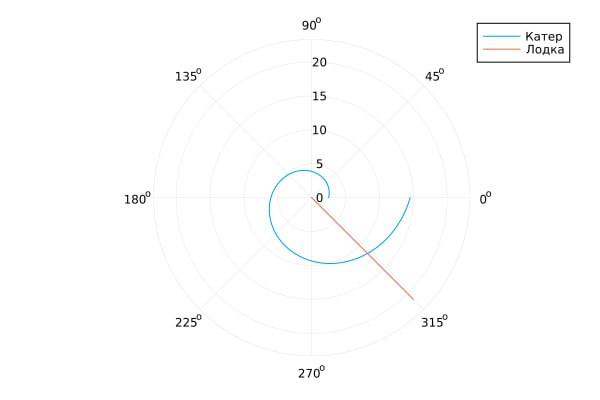

---
## Front matter
title: "Презентация по лабораторной работе №2"
subtitle: "Задача о Погоне"
author: "Озьяс Стев Икнэль Дани"

## Generic otions
lang: ru-RU

## Formatting
toc: false
slide_level: 2
theme: metropolis
header-includes:
- \metroset{progressbar=frametitle,sectionpage=progressbar,numbering=fraction}
- '\makeatletter'
- '\beamer@ignorenonframefalse'
- '\makeatother'
aspectratio: 43
section-titles: true
---

# Информация

## Докладчик

:::::::::::::: {.columns align=center}
::: {.column width="70%"}

  * Озьяс Стев Икнэль Дани
  * студент группы НКНбд-01-21
  * Российский университет дружбы народов
  * <https://github.com/Dacossti>

:::
::: {.column width="30%"}

:::
::::::::::::::

# Цели и задачи работы

## Цель лабораторной работы

Рассмотрим задачу преследования браконьеров береговой охраной. На море в тумане катер береговой охраны преследует лодку браконьеров. Через определенный промежуток времени туман рассеивается, и лодка обнаруживается на расстоянии k км от катера. Затем лодка снова скрывается в тумане и уходит прямолинейно в неизвестном направлении.

Необходимо определить по какой траектории необходимо двигаться катеру, чтоб нагнать лодку.

## Задание к лабораторной работе

1. Запишите уравнение, описывающее движение катера, с начальными условиями для двух случаев (в зависимости от расположения катера относительно лодки в начальный момент времени).
2. Постройте траекторию движения катера и лодки для двух случаев.
3. Найдите точку пересечения траектории катера и лодки 

# Процесс выполнения лабораторной работы

## Решение

Построили графики траекторий катера и лодки в полярных координатах для первого случая.

{ #fig:001 width=70% height=70% }

## Решение

Построили графики траекторий катера и лодки в полярных координатах для второго случая.

{ #fig:002 width=70% height=70% }

## Решение

Точка пересечения графиков является точкой пересечения катера и лодки.

По первому графику можно сказать, что эта точка пересечения примерно в (7π/4, 12.xx).

По второму графику можно сказать, что эта точка пересечения примерно в (7π/4, 8.xx).

Наблюдаем, что при погоне «по часовой стрелке» для достижения цели потребуется пройти меньшее расстояния.

# Выводы по проделанной работе

## Вывод

Рассмотрели задачу о погоне. Провели анализ и вывод дифференциальных уравнений. Смоделировали ситуацию.

