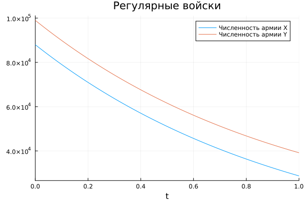
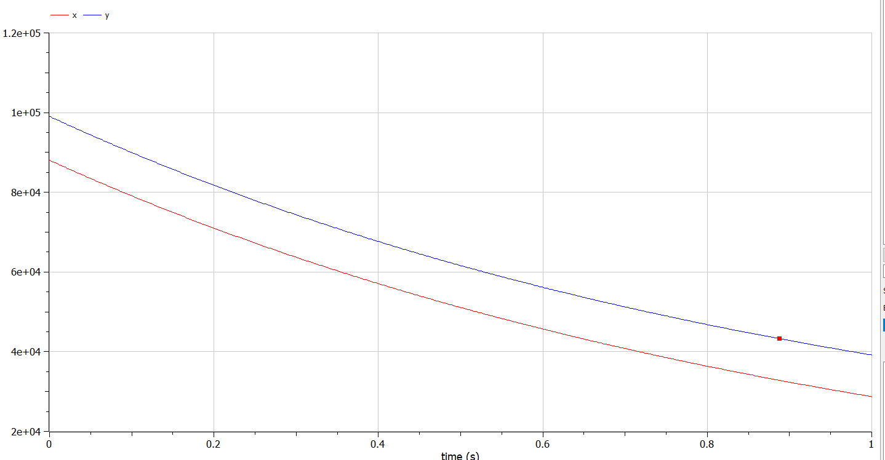
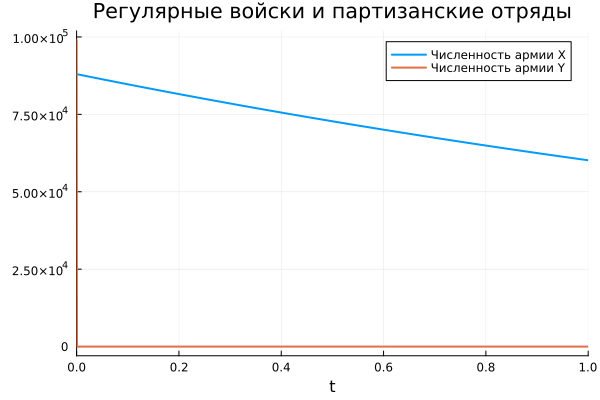
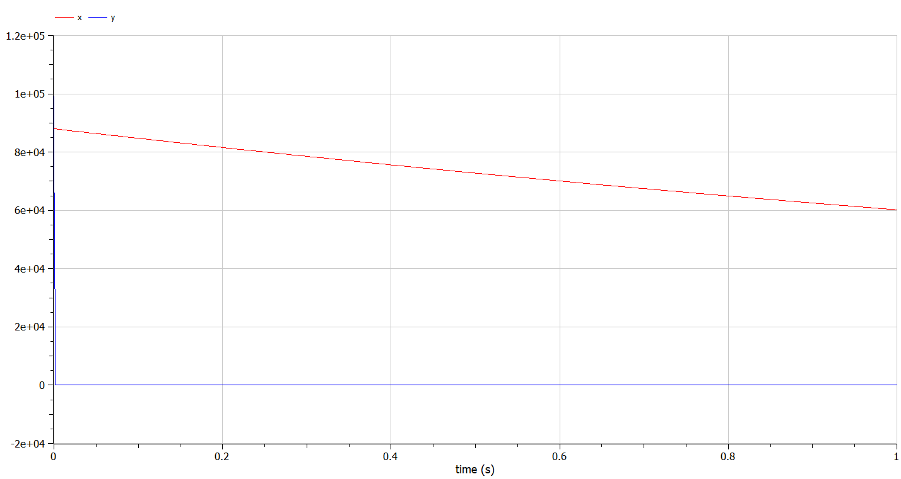

---
## Front matter
title: "Презентация по лабораторной работе №3"
subtitle: "Модель боевых действий"
author: "Озьяс Стев Икнэль Дани"

## Generic otions
lang: ru-RU

## Formatting
toc: false
slide_level: 2
theme: metropolis
header-includes:
- \metroset{progressbar=frametitle,sectionpage=progressbar,numbering=fraction}
- '\makeatletter'
- '\beamer@ignorenonframefalse'
- '\makeatother'
aspectratio: 43
section-titles: true
---

# Информация

## Докладчик

:::::::::::::: {.columns align=center}
::: {.column width="70%"}

  * Озьяс Стев Икнэль Дани
  * студент группы НКНбд-01-21
  * Российский университет дружбы народов
  * <https://github.com/Dacossti>

:::
::: {.column width="30%"}

:::
::::::::::::::

# Цели и задачи работы

## Цель лабораторной работы
 
Будем рассматривать 2 случая ведения боевых действий по модели Ланчестера.

1. Боевые действия между регулярными войсками 
2. Боевые действия с участием регулярных войск и партизанских отрядов

## Задание к лабораторной работе

1. Изучать модель Ланчестера
2. Построить графики для обеих армий
3. Определить кто из них победитель

# Процесс выполнения лабораторной работы

## Решение 

Построили графики изменения численности войск армии $X$ и армии $Y$ для следующих случаев:

1. Модель боевых действий между регулярными войсками

$$
 \begin{cases}
	\frac{dx}{dt}= -0.45x(t) - 0.55y(t) + sin(t + 15)
	\\   
	\frac{dy}{dt}= -0.58x(t) - 0.45y(t) + cos(t + 3)
 \end{cases}
$$

## Решение

{ #fig:001 width=70% height=70% }

## Решение

{ #fig:003 width=70% height=70% }

По решению модели Ланчестера оказывается что армия $Y$ - победитель.

## Решение

2. Модель ведение боевых действий с участием регулярных войск и партизанских отрядов

$$
 \begin{cases}
	\frac{dx}{dt}= -0.37(t) - 0.67y(t) + sin(7t) + 1
	\\   
	\frac{dy}{dt}= -0.57x(t)y(t) - 0.39y(t) + cos(8t) + 1
 \end{cases}
$$

## Решение

{ #fig:002 width=70% height=70% }

## Решение

{ #fig:004 width=70% height=70% }

По решению модели Ланчестера оказывается что армия $X$ - победитель.

# Выводы по проделанной работе

## Вывод

В результате проделанной лабораторной работы мы познакомились с моделями Ланчестнера. Проверили, как работает модель в различных ситуациях, построили графики $x(t)$ и $y(t)$ в рассматриваемых случаях.
