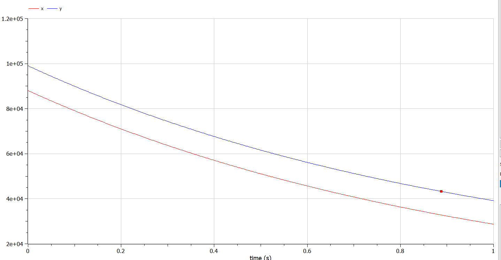
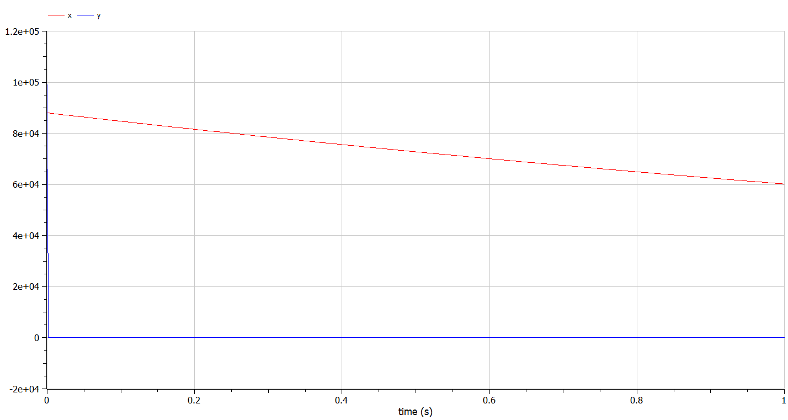

---
# Front matter
lang: ru-RU
title: "Отчет по Лабораторной Работе №3"
subtitle: "Модель Боевых Действий- Вариант 27"
author: "Озьяс Стев Икнэль Дани"

## Pdf output format
toc: true # Table of contents
toc-depth: 2
fontsize: 12pt
linestretch: 1.5
papersize: a4
documentclass: scrreprt
## I18n polyglossia
polyglossia-lang:
  name: russian
  options:
        - spelling=modern
        - babelshorthands=true
polyglossia-otherlangs:
  name: english
## I18n babel
babel-lang: russian
babel-otherlangs: english
## Fonts
mainfont: PT Serif
romanfont: PT Serif
sansfont: PT Sans
monofont: PT Mono
mainfontoptions: Ligatures=TeX
romanfontoptions: Ligatures=TeX
sansfontoptions: Ligatures=TeX,Scale=MatchLowercase
monofontoptions: Scale=MatchLowercase,Scale=0.9
## Biblatex
biblatex: true
biblio-style: "gost-numeric"
biblatexoptions:
  - parentracker=true
  - backend=biber
  - hyperref=auto
  - language=auto
  - autolang=other*
  - citestyle=gost-numeric
## Pandoc-crossref LaTeX customization
figureTitle: "Рис."
tableTitle: "Таблица"
listingTitle: "Листинг"
lofTitle: "Цель Работы"
lotTitle: "Ход Работы"
lolTitle: "Листинги"
## Misc options
indent: true
header-includes:
  - \usepackage{indentfirst}
  - \usepackage{float} # keep figures where there are in the text
  - \floatplacement{figure}{H} # keep figures where there are in the text
---


# Цель работы

Будем рассматривать 2 случая ведения боевых действий по модели Ланчестера.


# Задание

1. Изучать модель Ланчестера
2. Построить графики для обеих армий
3. Определить кто из них победитель

# Выполнение лабораторной работы

## Теоретические сведения

Будем рассматривать 2 случая ведения боевых действий:

1. Боевые действия между регулярными войсками 
2. Боевые действия с участием регулярных войск и партизанских отрядов 

В первом случае численность регулярных войск определяется тремя факторами:

1. скорость уменьшения численности войск из-за причин, не связанных с боевыми действиями (болезни, травмы, дезертирство);
2. скорость потерь, обусловленных боевыми действиями противоборствующих сторон (что связанно с качеством стратегии, уровнем вооружения, профессионализмом солдат и т.п.);
3. скорость поступления подкрепления (задаётся некоторой функцией от времени). 

В этом случае модель боевых действий между регулярными войсками описывается следующим образом

$$
 \begin{cases}
	\frac{dx}{dt}= -a(t)x(t) - b(t)y(t) + P(t)
	\\   
	\frac{dy}{dt}= -c(t)x(t) - h(t)y(t) + Q(t)
 \end{cases}
$$

Потери, не связанные с боевыми действиями, описывают члены $–a(t)x(t)$ и $–h(t)y(t)$, члены $–b(t)y(t)$ и $–c(t)x(t)$ отражают потери на поле боя. Коэффициенты $b(t)$, $c(t)$ указывают на эффективность боевых действий со стороны $y$ и $x$ соответственно, $a(t)$,$h(t)$  - величины, характеризующие степень влияния различных факторов на потери. Функции $P(t)$,$Q(t)$  учитывают возможность подхода подкрепления к войскам $X$ и $Y$ в течение одного дня. 

Во втором случае в борьбу добавляются партизанские отряды. Нерегулярные войска в отличии от постоянной армии менее уязвимы, так как действуют скрытно, в этом случае сопернику приходится действовать неизбирательно, по площадям, занимаемым партизанами. Поэтому считается, что темп потерь партизан, проводящих свои операции в разных местах на некоторой известной территории, пропорционален не только численности армейских соединений, но и численности самих партизан. В результате модель принимает вид:

$$
 \begin{cases}
	\frac{dx}{dt}= -a(t)x(t) - b(t)y(t) + P(t)
	\\   
	\frac{dy}{dt}= -c(t)x(t)y(t) - h(t)y(t) + Q(t)
 \end{cases}
$$

## Задача

Между страной $X$ и страной $Y$ идет война. Численность состава войск исчисляется от начала войны, и являются временными функциями $x(t)$ и $y(t)$
В начальный момент времени страна $X$ имеет армию численностью 88000 человек,  а в распоряжении страны $Y$ армия численностью в 99000 человек.
Для упрощения модели считаем, что коэффициенты $a, b, c, h$ постоянны. Также считаем $P(t), Q(t)$ непрерывные функции.

Постройте графики изменения численности войск армии $X$ и армии $Y$ для следующих случаев:

1. Модель боевых действий между регулярными войсками

$$
 \begin{cases}
	\frac{dx}{dt}= -0.45x(t) - 0.55y(t) + sin(t + 15)
	\\   
	\frac{dy}{dt}= -0.58x(t) - 0.45y(t) + cos(t + 3)
 \end{cases}
$$

{ #fig:001 width=70% height=70% }

{ #fig:003 width=70% height=70% }

По решению модели Ланчестера оказывается что армия $Y$ - победитель.

2. Модель ведение боевых действий с участием регулярных войск и партизанских отрядов

$$
 \begin{cases}
	\frac{dx}{dt}= -0.37(t) - 0.67y(t) + sin(7t) + 1
	\\   
	\frac{dy}{dt}= -0.57x(t)y(t) - 0.39y(t) + cos(8t) + 1
 \end{cases}
$$

{ #fig:002 width=70% height=70% }

{ #fig:004 width=70% height=70% }

По решению модели Ланчестера оказывается что армия $X$ - победитель.


## Код программы (Julia)

Далее приведен код программы, написанной на языке Julia.

```julia
using Plots
using DifferentialEquations
using OrdinaryDiffEq


# начальные условия
x0 = 88000;   #численность первой армии
y0 = 99000;    #численность второй армии

t0 = 0;    #начальный момент времени
a = 0.45;    #константа, характеризующая степень влияния различных факторов на потери
b = 0.55;    #эффективность боевых действий армии у
c = 0.58;   #эффективность боевых действий армии х
h = 0.45;    #константа, характеризующая степень влияния различных факторов на потери

tmax = 1;   #предельный момент времени

t = (t0;tmax);
    
# ПЕРВЫЙ СЛУЧАЙ
    
function P(t)      #возможность подхода подкрепления к армии х
    p = sin(t + 15);
    return p;
end


function Q(t)      #возможность подхода подкрепления к армии у
    q = cos(t + 3);
    return q;
end


#Система дифференциальных уравнений
function f(du, u, p, t)
    du[1] = - a*u[1] - b*u[2] + P(t);        #изменение численности первой армии
    du[2] = - c*u[1] - h*u[2] + Q(t);        #изменение численности второй армии
end


v0 = [x0;y0];    #Вектор начальных условий

prob = ODEProblem(f, v0, t)
sol = solve(prob)


plot(sol, vars=(1), label = "Численность армии X", title = "Регулярные войски")
plot!(sol, vars=(2), label = "Численность армии Y")


a = 0.38;    #константа, характеризующая степень влияния различных факторов на потери
b = 0.67;    #эффективность боевых действий армии у
c = 0.57;   #эффективность боевых действий армии х
h = 0.39;    #константа, характеризующая степень влияния различных факторов на потери


# ВТОРОЙ СЛУЧАЙ
    
function P(t)      #возможность подхода подкрепления к армии х
    p = sin(7*t) + 1;
    return p;
end


function Q(t)      #возможность подхода подкрепления к армии у
    q = cos(8*t) + 1;
    return q;
end


#Система дифференциальных уравнений
function f(du, u, p, t)
    du[1] = - a*u[1] - b*u[2] + P(t);        #изменение численности первой армии
    du[2] = - c*u[1]*u[2] - h*u[2] + Q(t);        #изменение численности второй армии
end


v0 = [x0;y0];    #Вектор начальных условий

prob = ODEProblem(f, v0, t)
sol = solve(prob)


plot(sol, vars=(1), linewidth = 2, label = "Численность армии X", title = "Регулярные войски и партизанские отряды")
plot!(sol, vars=(2), linewidth = 2, label = "Численность армии Y")

```

## Код программы (OpenModelica)

Далее приведен код программы, написанной в OpenModelica.

```julia
//ПЕРВЫЙ СЛУЧАЙ
model lab3

parameter Real a = 0.45;   //константа, характеризующая степень влияния различных факторов на потери
parameter Real b = 0.55;    //эффективность боевых действий армии у
parameter Real c = 0.58;     //эффективность боевых действий армии х
parameter Real h = 0.45;     //константа, характеризующая степень влияния различных факторов на потери

//начальные условия
Real x(start = 88000);     //численность первой армии
Real y(start = 99000);     //численность второй армии

Real P;
Real Q;

equation
  der(x) = - a*x - b*y + P; //изменение численности первой армии
  der(y) = - c*x - h*y + Q;  //изменение численности второй армии
  P = sin(time + 15);
  Q = cos(time + 3);

end lab3;

```


```julia
//ВТОРОЙ СЛУЧАЙ
model lab3

parameter Real a = 0.38;   //константа, характеризующая степень влияния различных факторов на потери
parameter Real b = 0.67;    //эффективность боевых действий армии у
parameter Real c = 0.57;     //эффективность боевых действий армии х
parameter Real h = 0.39;     //константа, характеризующая степень влияния различных факторов на потери

//начальные условия
Real x(start = 88000);     //численность первой армии
Real y(start = 99000);     //численность второй армии

Real P;
Real Q;

equation
  der(x) = - a*x - b*y + P; //изменение численности первой армии
  der(y) = - c*x*y - h*y + Q;  //изменение численности второй армии
  P = sin(7*time) + 1;
  Q = cos(8*time) + 1;

end lab3;

```


# Выводы

В результате проделанной лабораторной работы мы познакомились с моделями Ланчестера. Проверили, как работает модель в различных ситуациях, построили графики $x(t)$ и $y(t)$ в рассматриваемых случаях.

# Список литературы

1. [Законы Осипова — Ланчестера](https://ru.wikipedia.org/wiki/Законы_Осипова_—_Ланчестера)
2. [Дифференциальные уравнения динамики боя](https://zen.yandex.ru/media/id/5fd3c685994c494848984b63/differencialnye-uravneniia-dinamiki-boia-5fd4bcc45a2c8e1f2cc208f1)
3. [Элементарные модели боя](https://intuit.ru/studies/educational_groups/594/courses/499/lecture/11353?page=7)
