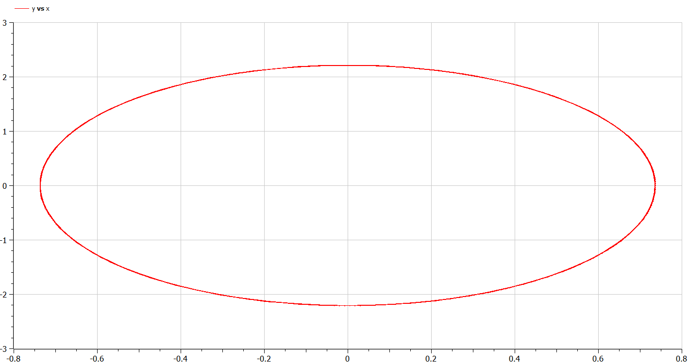
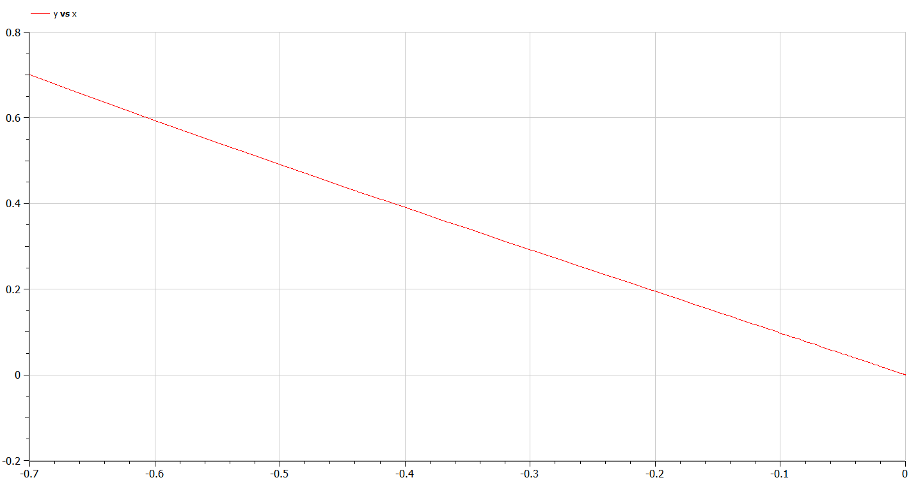
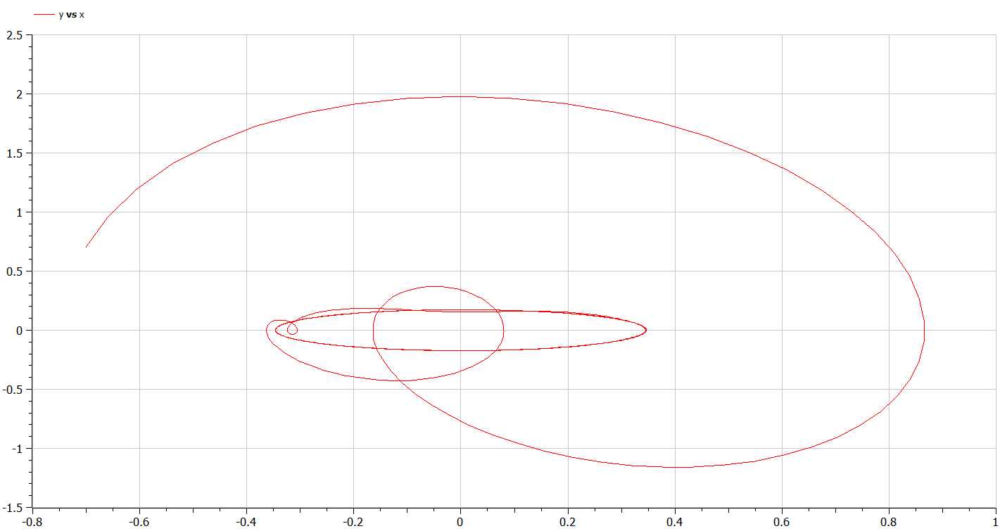

---
## Front matter
title: "Презентация по лабораторной работе №4"
subtitle: "Модель гармонических колебаний"
author: "Озьяс Стев Икнэль Дани"

## Generic otions
lang: ru-RU

## Formatting
toc: false
slide_level: 2
theme: metropolis
header-includes:
- \metroset{progressbar=frametitle,sectionpage=progressbar,numbering=fraction}
- '\makeatletter'
- '\beamer@ignorenonframefalse'
- '\makeatother'
aspectratio: 43
section-titles: true
---

# Информация

## Докладчик

:::::::::::::: {.columns align=center}
::: {.column width="70%"}

  * Озьяс Стев Икнэль Дани
  * студент группы НКНбд-01-21
  * Российский университет дружбы народов
  * <https://github.com/Dacossti>

:::
::: {.column width="30%"}

:::
::::::::::::::

# Цели и задачи работы

## Цель лабораторной работы

Построить фазовый портрет гармонического осциллятора и решение уравнения гармонического осциллятора для следующих случаев:

1. Колебания гармонического осциллятора без затуханий и без действий внешней силы
2. Колебания гармонического осциллятора c затуханием и без действий внешней силы
3. Колебания гармонического осциллятора c затуханием и под действием внешней силы

## Задание к лабораторной работе

1. Изучать модель гармонических колебаний
2. Построить фазовый портрет гармонического осциллятора и решение уравнения гармонического осциллятора

# Процесс выполнения лабораторной работы

## Решение

Постройте фазовый портрет гармонического осциллятора и решение уравнения гармонического осциллятора для следующих случаев:

1. Колебания гармонического осциллятора без затуханий и без действий внешней силы

x'' + 9 x = 0

{ #fig:001 width=70% height=70% }

## Решение

{ #fig:004 width=70% height=70% }

## Решение

2. Колебания гармонического осциллятора c затуханием и без действий внешней силы

x'' + 5.5 x' + 4.4 x = 0

{ #fig:002 width=70% height=70% }

## Решение

{ #fig:005 width=70% height=70% }

## Решение

3. Колебания гармонического осциллятора c затуханием и под действием внешней силы

x'' + x' + 6 x = 2* cos(0.5*t)

{ #fig:003 width=70% height=70% }

## Решение

{ #fig:006 width=70% height=70% }

# Выводы по проделанной работе

## Вывод

В результате проделанной лабораторной работы мы познакомились с моделем гармонических колебаний. 
Проверили, как работает модель в различных ситуациях, построили фазовые портреты в рассматриваемых случаях.

# Список литературы

1. [Гармонические_колебания](https://ru.wikipedia.org/wiki/Гармонические_колебания)