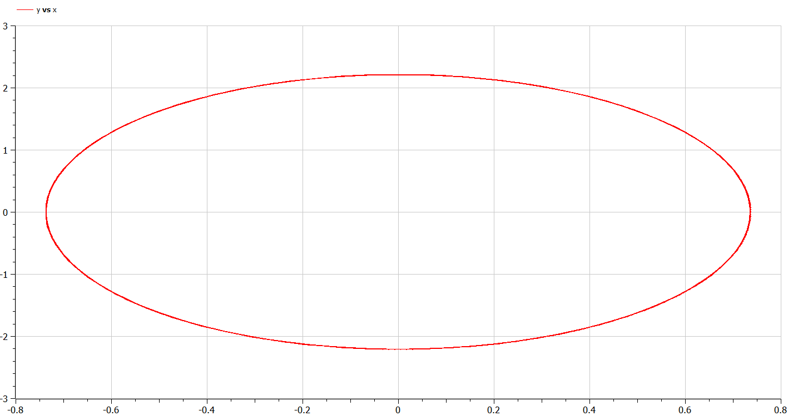
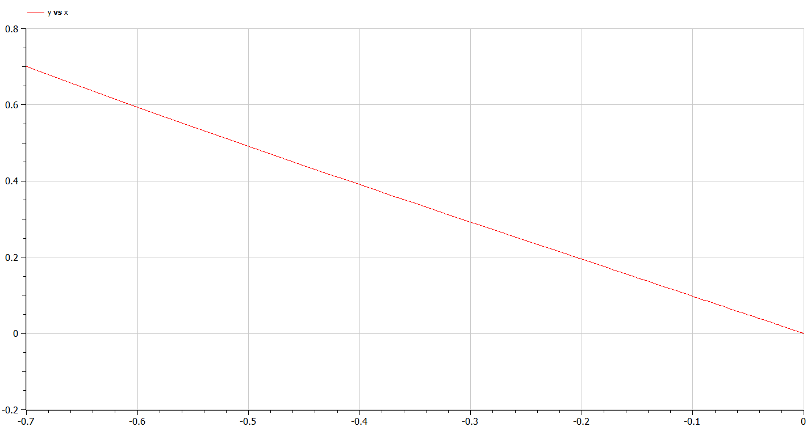
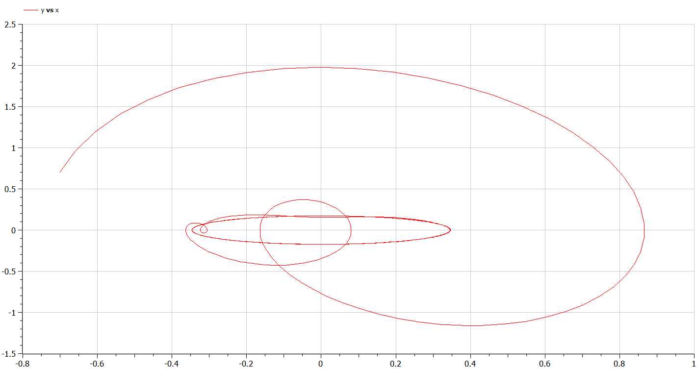

---
# Front matter
lang: ru-RU
title: "Отчет по Лабораторной Работе №4"
subtitle: "Модель гармонических колебаний - Вариант 27"
author: "Озьяс Стев Икнэль Дани"

## Pdf output format
toc: true # Table of contents
toc-depth: 2
fontsize: 12pt
linestretch: 1.5
papersize: a4
documentclass: scrreprt
## I18n polyglossia
polyglossia-lang:
  name: russian
  options:
        - spelling=modern
        - babelshorthands=true
polyglossia-otherlangs:
  name: english
## I18n babel
babel-lang: russian
babel-otherlangs: english
## Fonts
mainfont: PT Serif
romanfont: PT Serif
sansfont: PT Sans
monofont: PT Mono
mainfontoptions: Ligatures=TeX
romanfontoptions: Ligatures=TeX
sansfontoptions: Ligatures=TeX,Scale=MatchLowercase
monofontoptions: Scale=MatchLowercase,Scale=0.9
## Biblatex
biblatex: true
biblio-style: "gost-numeric"
biblatexoptions:
  - parentracker=true
  - backend=biber
  - hyperref=auto
  - language=auto
  - autolang=other*
  - citestyle=gost-numeric
## Pandoc-crossref LaTeX customization
figureTitle: "Рис."
tableTitle: "Таблица"
listingTitle: "Листинг"
lofTitle: "Цель Работы"
lotTitle: "Ход Работы"
lolTitle: "Листинги"
## Misc options
indent: true
header-includes:
  - \usepackage{indentfirst}
  - \usepackage{float} # keep figures where there are in the text
  - \floatplacement{figure}{H} # keep figures where there are in the text
---

# Цель работы

Построить фазовый портрет гармонического осциллятора и решение уравнения гармонического осциллятора для следующих случаев:
1. Колебания гармонического осциллятора без затуханий и без действий внешней силы
2. Колебания гармонического осциллятора c затуханием и без действий внешней силы
3. Колебания гармонического осциллятора c затуханием и под действием внешней силы

# Задание

1. Изучать модель гармонических колебаний
2. Построить фазовый портрет гармонического осциллятора и решение уравнения гармонического осциллятора

# Выполнение лабораторной работы

## Теоретические сведения

Движение грузика на пружинке, маятника, заряда в электрическом контуре, а также эволюция во времени многих систем в физике, химии, биологии и другихнауках при определенных предположениях можно описать одним и тем же
дифференциальным уравнением, которое в теории колебаний выступает в качествеосновной модели. Эта модель называется линейным гармоническим осциллятором. Уравнение свободных колебаний гармонического осциллятора имеет следующий вид:		

x'' + 2 g x' + w^2 x = f(t)

где x – переменная, описывающая состояние системы (смещение грузика, заряд конденсатора и т.д.), g - затухание (параметр, характеризующий потери энергии (трение в механической системе, сопротивление в контуре), w – собственная частота колебаний, f(t) - внешняя сила , t – время.


## Задача

Постройте фазовый портрет гармонического осциллятора и решение уравнения гармонического осциллятора для следующих случаев:

1. Колебания гармонического осциллятора без затуханий и без действий внешней силы

x'' + 9 x = 0

{ #fig:001 width=70% height=70% }

{ #fig:004 width=70% height=70% }

2. Колебания гармонического осциллятора c затуханием и без действий внешней силы

x'' + 5.5 x' + 4.4 x = 0

{ #fig:002 width=70% height=70% }

{ #fig:005 width=70% height=70% }

3. Колебания гармонического осциллятора c затуханием и под действием внешней силы

x'' + x' + 6 x = 2cos(0.5t)

{ #fig:003 width=70% height=70% }

{ #fig:006 width=70% height=70% }


## Код программы (Julia)

```julia
using Plots
using DifferentialEquations

#ПЕРВЫЙ СЛУЧАЙ


#Параметры осциллятора
#x'' + g * x' + w^2 * x = f(t)
#w - частота
#g - затухание

w = 3;
g = 0.00;

#Правая часть уравнения f(t)

function f(t)
    f = 0;
    return f;
end

#Вектор-функция f(t, x)
#для решения системы дифференциальных уравнений
#x' = y(t, x)
#где x - искомый вектор

function F(du,u, p, t)
    du[1] = u[2];
    du[2] = -w.* w.* u[1] - g.* u[2] + f(t);
end


#Вектор начальных условий
#x(t0) = x0

v0 = [-0.7; 0.7];

#Интервал на котором будет решаться задача
t = (0; 37);

#Решаем дифференциальные уравнения с начальным условием x(t0) = x0 на интервале t
#с правой частью, заданной y и записываем решение в матрицу x

prob = ODEProblem(F, v0, t);
sol = solve(prob);

#Переписываем отдельно x в y1, x' в y2

y1 = [];
y2 = [];

for values in sol.u
    push!(y1, values[1]);
    push!(y2, values[2]);
end

#Рисуем фазовый портрет: зависимость x(x')
display(plot(y1, y2, legend=:topright, label= "Фазовый портрет №1"));

savefig("image1.png")


#ВТОРОЙ СЛУЧАЙ
w = sqrt(4.4);
g = 5.5;

#Правая часть уравнения f(t)

function f(t)
    f = 0;
    return f;
end

#Вектор-функция f(t, x)
#для решения системы дифференциальных уравнений
#x' = y(t, x)
#где x - искомый вектор

function F(du,u, p, t)
    du[1] = u[2];
    du[2] = -w.* w.* u[1] - g.* u[2] + f(t);
end


#Вектор начальных условий
#x(t0) = x0

v0 = [-0.7; 0.7];

#Интервал на котором будет решаться задача
t = (0; 37);

#Решаем дифференциальные уравнения с начальным условием x(t0) = x0 на интервале t
#с правой частью, заданной y и записываем решение в матрицу x

prob = ODEProblem(F, v0, t);
sol = solve(prob);

#Переписываем отдельно x в y1, x' в y2

y1 = [];
y2 = [];

for values in sol.u
    push!(y1, values[1]);
    push!(y2, values[2]);
end

#Рисуем фазовый портрет: зависимость x(x')
display(plot(y1, y2, legend=:topright, label= "Фазовый портрет №2"));

savefig("image2.png")


#ТРЕТИЙ СЛУЧАЙ

w = sqrt(6);
g = 1;

#Правая часть уравнения f(t)

function f(t)
    f = 2*cos(0.5*t);
    return f;
end

#Вектор-функция f(t, x)
#для решения системы дифференциальных уравнений
#x' = y(t, x)
#где x - искомый вектор

function F(du,u, p, t)
    du[1] = u[2];
    du[2] = -w.* w.* u[1] - g.* u[2] + f(t);
end


#Вектор начальных условий
#x(t0) = x0

v0 = [-0.7; 0.7];

#Интервал на котором будет решаться задача
t = (0; 37);

#Решаем дифференциальные уравнения с начальным условием x(t0) = x0 на интервале t
#с правой частью, заданной y и записываем решение в матрицу x

prob = ODEProblem(F, v0, t);
sol = solve(prob);

#Переписываем отдельно x в y1, x' в y2

y1 = [];
y2 = [];

for values in sol.u
    push!(y1, values[1]);
    push!(y2, values[2]);
end

#Рисуем фазовый портрет: зависимость x(x')
display(plot(y1, y2, legend=:topright, label= "Фазовый портрет №3"));

savefig("image3.png")

```

## Код программы (OpenModelica)

```julia
//ПЕРВЫЙ СЛУЧАЙ x'' + 9*x = 0
model lab4

//Параметры осциллятора
//x'' + g* x' + w^2* x = f(t)
//w - частота
//g - затухание

parameter Real w = 3.0;
parameter Real g = 0.0;

//Вектор начальных условий x(t0) = x0
Real x(start=-0.7);
Real y(start=0.7);
Real f;

equation
  der(x) = y;
  der(y) = -w.* w.* x - g.* y - f;
  f = 0.0;

end lab4;

```


```julia
//ВТОРОЙ СЛУЧАЙ x'' + x' + 6* x = 2* cos(0.5*t)
model lab4

//Параметры осциллятора
//x'' + g* x' + w^2* x = f(t)
//w - частота
//g - затухание

parameter Real w = sqrt(4.4);
parameter Real g = 5.5;

//Вектор начальных условий x(t0) = x0
Real x(start=-0.7);
Real y(start=0.7);
Real f;

equation
  der(x) = y;
  der(y) = -w.* w.* x - g.* y + f;
  f = 0.0;

end lab4;

```


```julia
//ТРЕТЬИЙ СЛУЧАЙ x'' + x' + 6* x = 2* cos(0.5*t)
model lab4

//Параметры осциллятора
//x'' + g* x' + w^2* x = f(t)
//w - частота
//g - затухание

parameter Real w = sqrt(6);
parameter Real g = 1.0;

//Вектор начальных условий x(t0) = x0
Real x(start=-0.7);
Real y(start=0.7);
Real f;

equation
  der(x) = y;
  der(y) = -w.* w.* x - g.* y + f;
  f = 2* cos(0.5*time);

end lab4;

```


# Выводы

В результате проделанной лабораторной работы мы познакомились с моделем гармонических колебаний. Проверили, как работает модель в различных ситуациях, построили фазовые портреты в рассматриваемых случаях.

# Список литературы

1. [Гармонические_колебания](https://ru.wikipedia.org/wiki/Гармонические_колебания)
