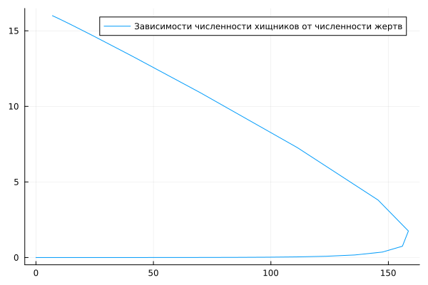
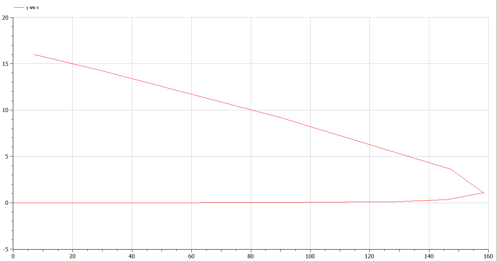
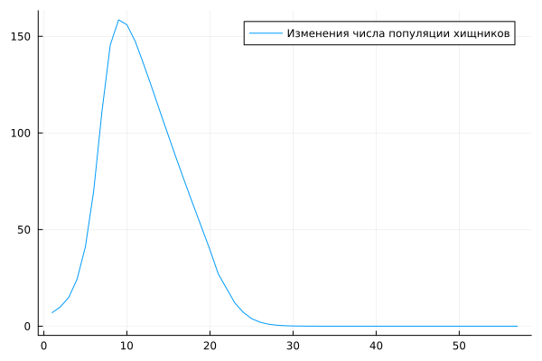
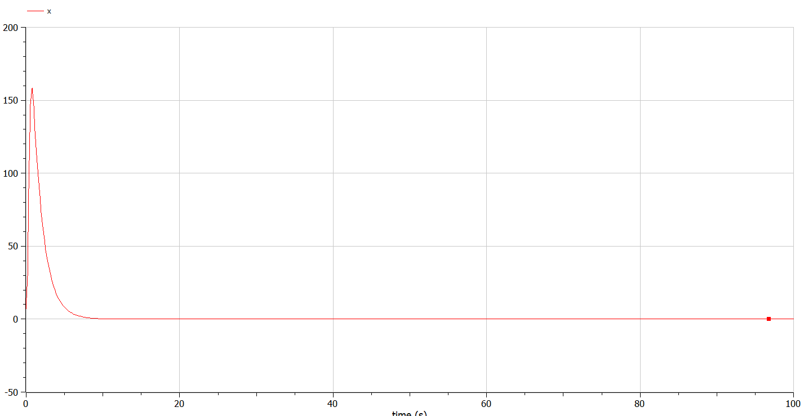
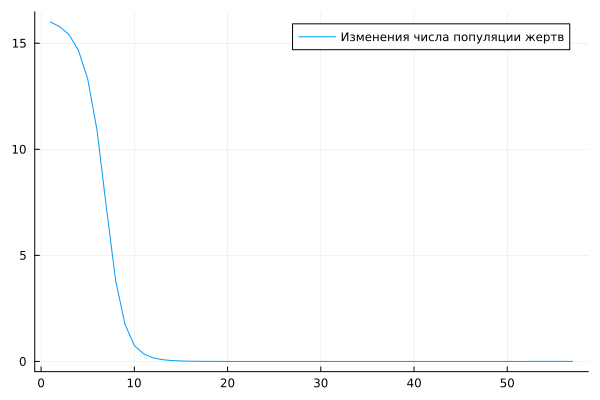
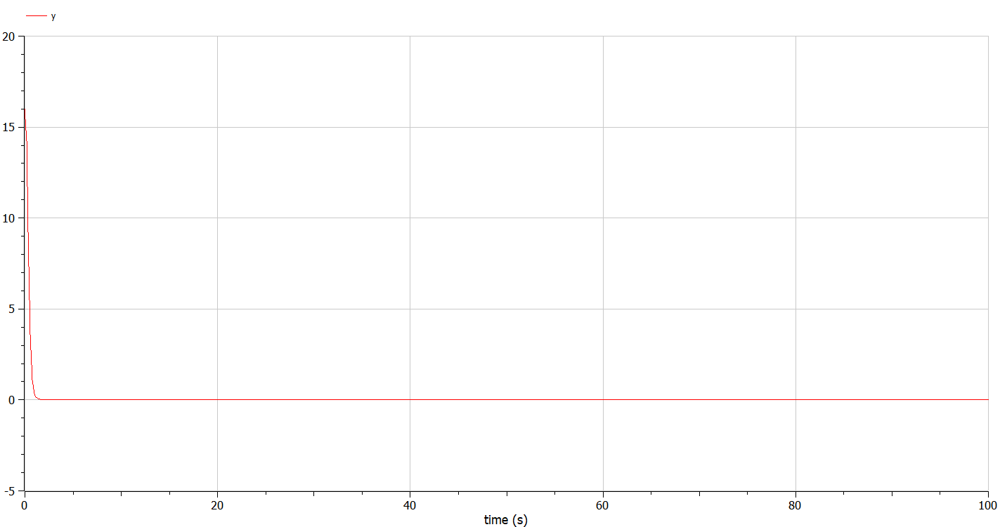

---
## Front matter
title: "Презентация по лабораторной работе №5"
subtitle: "Модель хищник-жертва"
author: "Озьяс Стев Икнэль Дани"

## Generic otions
lang: ru-RU

## Formatting
toc: false
slide_level: 2
theme: metropolis
header-includes:
- \metroset{progressbar=frametitle,sectionpage=progressbar,numbering=fraction}
- '\makeatletter'
- '\beamer@ignorenonframefalse'
- '\makeatother'
aspectratio: 43
section-titles: true
---

# Информация

## Докладчик

:::::::::::::: {.columns align=center}
::: {.column width="70%"}

  * Озьяс Стев Икнэль Дани
  * студент группы НКНбд-01-21
  * Российский университет дружбы народов
  * <https://github.com/Dacossti>

:::
::: {.column width="30%"}

:::
::::::::::::::

# Цели и задачи работы

## Цель лабораторной работы
 
Рассмотрим простейшую модель взаимодействия двух видов типа «хищник — жертва» -
модель Лотки-Вольтерры. 

## Задание к лабораторной работе

В лесу проживают х число волков, питающихся зайцами, число которых в этом же лесу у. Пока число зайцев достаточно велико, для прокормки всех волков, численность волков растет до тех пор, пока не наступит момент, что корма перестанет хватать на всех. Тогда волки начнут умирать, и их численность будет уменьшаться. В этом случае в какой-то момент времени численность зайцев снова начнет увеличиваться, что повлечет за собой новый рост популяции волков. 

## Задание к лабораторной работе

1. Построить график зависимостиx $x$ от $y$ и графики функций x(t), y(t)
2. Найти стационарное состояние системы

# Процесс выполнения лабораторной работы

## Решение

1. Построили график зависимости $x$ от $y$:

{ #fig:001 width=70% }

## Решение

{ #fig:004 width=70% }

## Решение

Построили график функции x(t):

{ #fig:002 width=70% }

## Решение

{ #fig:005 width=70% }

## Решение

Построили график функции y(t):

{ #fig:003 width=70% }

## Решение

{ #fig:006 width=70% }

# Выводы по проделанной работе

## Вывод

В результате проделанной лабораторной работы мы познакомились с моделем эпидемии. Проверили, как работает модель в различных ситуациях, показали динамику изменения числа людей в каждой из трех групп в каждом случае.

# Список литературы

1. [Модель хищник-жертва](https://hal.science/hal-02509142v4/file/epidemie_ru.pdf)
