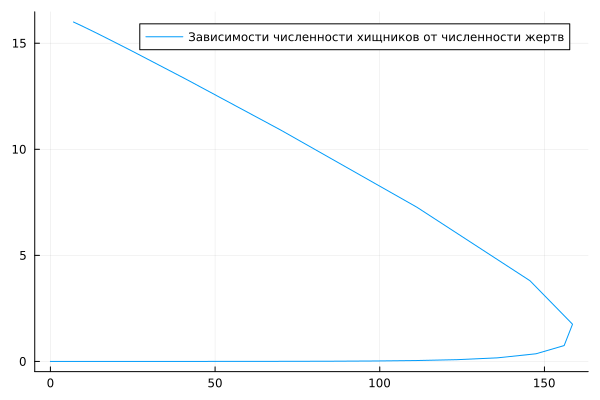
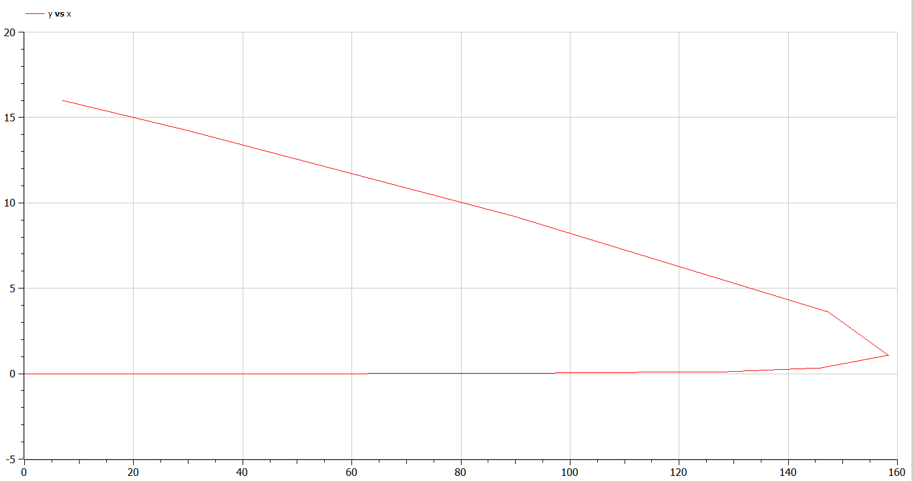
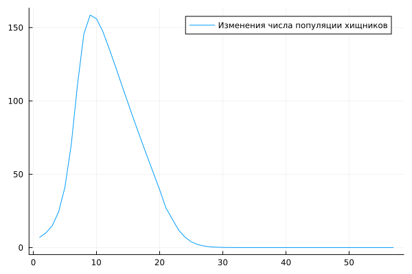
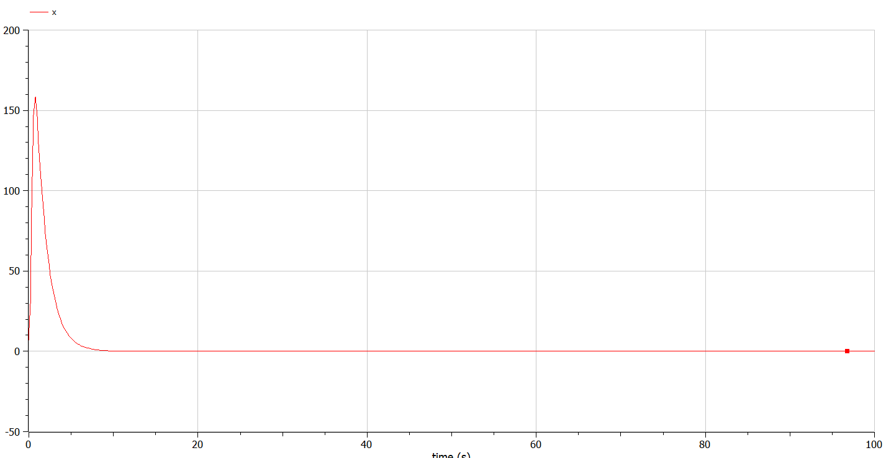
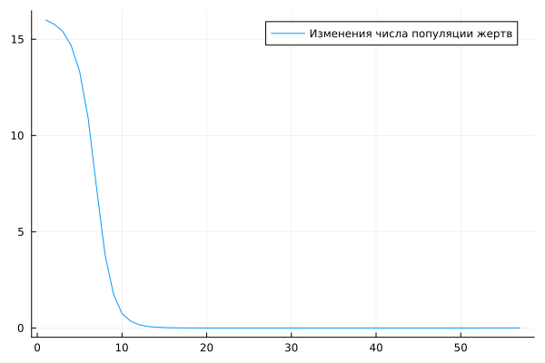
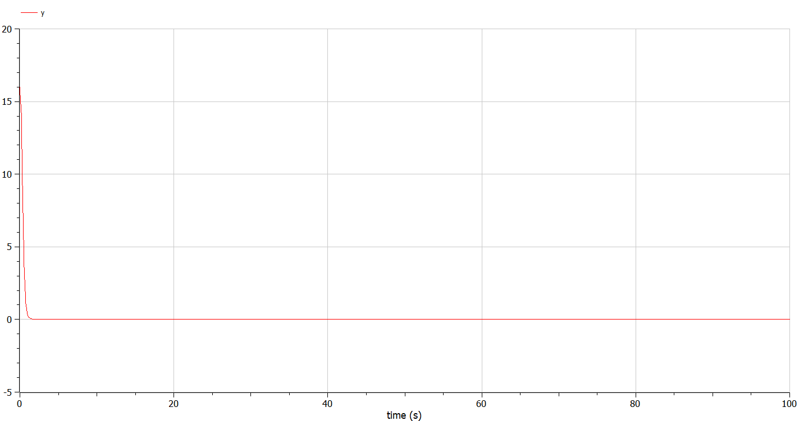

---
# Front matter
lang: ru-RU
title: "Отчет по Лабораторной Работе №5"
subtitle: "Модель хищник-жертва - Вариант 27"
author: "Озьяс Стев Икнэль Дани"

## Pdf output format
toc: true # Table of contents
toc-depth: 2
fontsize: 12pt
linestretch: 1.5
papersize: a4
documentclass: scrreprt
## I18n polyglossia
polyglossia-lang:
  name: russian
  options:
        - spelling=modern
        - babelshorthands=true
polyglossia-otherlangs:
  name: english
## I18n babel
babel-lang: russian
babel-otherlangs: english
## Fonts
mainfont: PT Serif
romanfont: PT Serif
sansfont: PT Sans
monofont: PT Mono
mainfontoptions: Ligatures=TeX
romanfontoptions: Ligatures=TeX
sansfontoptions: Ligatures=TeX,Scale=MatchLowercase
monofontoptions: Scale=MatchLowercase,Scale=0.9
## Biblatex
biblatex: true
biblio-style: "gost-numeric"
biblatexoptions:
  - parentracker=true
  - backend=biber
  - hyperref=auto
  - language=auto
  - autolang=other*
  - citestyle=gost-numeric
## Pandoc-crossref LaTeX customization
figureTitle: "Рис."
tableTitle: "Таблица"
listingTitle: "Листинг"
lofTitle: "Цель Работы"
lotTitle: "Ход Работы"
lolTitle: "Листинги"
## Misc options
indent: true
header-includes:
  - \usepackage{indentfirst}
  - \usepackage{mathtools}
  - \usepackage{float} # keep figures where there are in the text
  - \floatplacement{figure}{H} # keep figures where there are in the text
---


# Цель работы

Рассмотрим простейшую модель взаимодействия двух видов типа «хищник — жертва» -
модель Лотки-Вольтерры. 


# Задание

В лесу проживают х число волков, питающихся зайцами, число которых в этом же лесу у. Пока число зайцев достаточно велико, для прокормки всех волков, численность волков растет до тех пор, пока не наступит момент, что корма перестанет хватать на всех. Тогда волки начнут умирать, и их численность будет уменьшаться. В этом случае в какой-то момент времени численность зайцев снова начнет увеличиваться, что повлечет за собой новый рост популяции волков. Такой цикл будет повторяться, пока обе популяции будут существовать. Помимо этого, на численность стаи влияют болезни и старение. Данная модель описывается следующим уравнением:

$$\frac{dx}{dt} = -ax(t) + bx(t)y(t)$$

$$\frac{dy}{dt} = cx(t) - dx(t)y(t)$$

a, d - коэффициенты смертности
b, c - коэффициенты прироста популяции

1. Построить график зависимостиx $x$ от $y$ и графики функций x(t), y(t)
2. Найти стационарное состояние системы


# Выполнение лабораторной работы

## Теоретические сведения

Данная двувидовая модель основывается на следующих предположениях:

1. Численность популяции жертв x и хищников y зависят только от времени (модель не учитывает пространственное распределение популяции на занимаемой территории)
2. В отсутствии взаимодействия численность видов изменяется по модели Мальтуса, при этом число жертв увеличивается, а число хищников падает
3. Естественная смертность жертвы и естественная рождаемость хищника считаются несущественными
4. Эффект насыщения численности обеих популяций не учитывается
5. Скорость роста численности жертв уменьшается пропорционально численности хищников

$$\frac{dx}{dt} = -ax(t) + bx(t)y(t)$$

$$\frac{dy}{dt} = cx(t) - dx(t)y(t)$$

В этой модели x – число жертв, y - число хищников. Коэффициент a описывает скорость естественного прироста числа жертв в отсутствие хищников, с - естественное вымирание хищников, лишенных пищи в виде жертв. Вероятность взаимодействия жертвы и хищника считается пропорциональной как количеству жертв, так и числу самих хищников (xy). Каждый акт взаимодействия уменьшает популяцию жертв, но способствует увеличению популяции хищников (члены -bxy и dxy в правой части уравнения).


## Решение

1. Построили график зависимости $x$ от $y$:


{ #fig:001 width=70% }


{ #fig:004 width=70% }


Построили график функции x(t):

{ #fig:002 width=70% }


{ #fig:005 width=70% }


Построили график функции y(t):

{ #fig:003 width=70% }


{ #fig:006 width=70% }


## Код программы (Julia)

```julia
using Plots
using DifferentialEquations

a= 0.73; #коэффициент естественной смертности хищников
b= 0.037; #коэффициент естественного прироста жертв
c= 0.52; #коэффициент увеличения числа хищников
d= 0.039; #коэффициент смертности жертв


function f(du, u, p, t)
    du[1] = -a*u[1] + c*u[1]*u[2];
    du[2] = b*u[2] - d*u[1]*u[2];
end

t0 = 0;
v0=[7;16]; #начальное значение x0 и у0 (популяция хищников и популяция жертв)

t = (0,100);

prob = ODEProblem(f, v0, t);
sol = solve(prob)

y1 = [];
y2 = [];

for values in sol.u
    push!(y1, values[1]);
    push!(y2, values[2]);
end


display(plot(y1, label="Изменения числа популяции хищников")); #построение графика колебаний изменения числа популяции хищников
savefig("image1.png")
display(plot(y2, label="Изменения числа популяции жертв")); #построение графика колебаний изменения числа популяции жертв
savefig("image2.png")
display(plot(y1, y2, legend=:topright, label="Зависимости численности хищников от численности жертв")); #построение графика зависимости изменения численности хищников от изменения численности жертв
savefig("image3.png")
```

## Код программы (OpenModelica)

```julia
model lab5

parameter Real a= 0.73; //коэффициент естественной смертности хищников
parameter Real b= 0.037; //коэффициент естественного прироста жертв
parameter Real c= 0.52; //коэффициент увеличения числа хищников
parameter Real d= 0.039; //коэффициент смертности жертв

//начальное значение x0 и у0 (популяция хищников и популяция жертв)
Real x(start= 7);
Real y(start=16);


equation
  der(x) = -a*x + c*x*y;
  der(y) = b*y - d*x*y;

end lab5;
```

# Выводы

В результате проделанной лабораторной работы мы познакомились с моделем эпидемии. 
Проверили, как работает модель в различных ситуациях, показали динамику изменения числа людей в каждой из трех групп в каждом случае.

# Список литературы

1. [Модель эпидемии](https://hal.science/hal-02509142v4/file/epidemie_ru.pdf)
