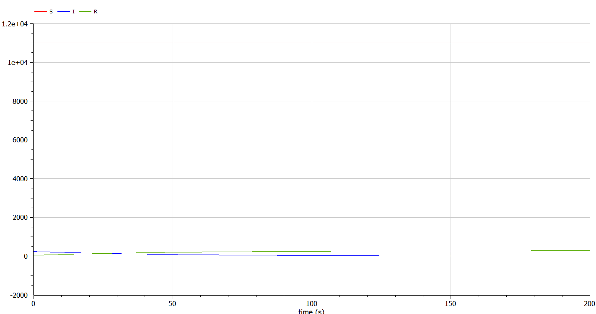
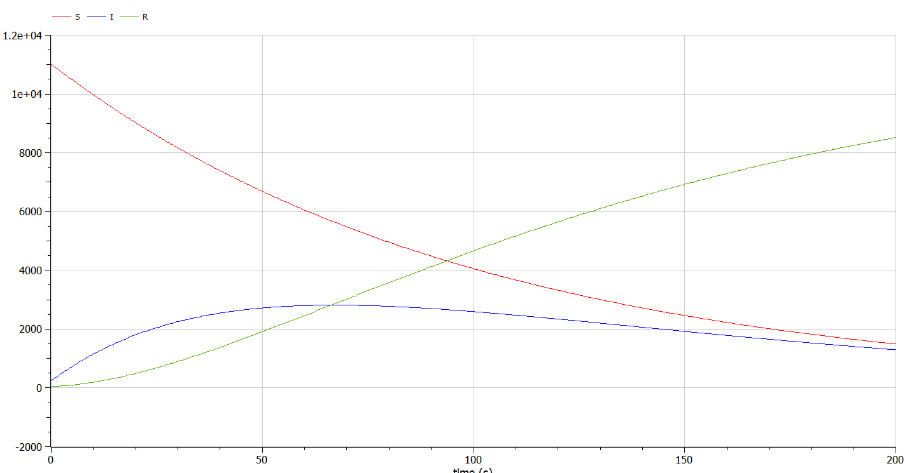

---
## Front matter
title: "Презентация по лабораторной работе №6"
subtitle: "Модель эпидемии"
author: "Озьяс Стев Икнэль Дани"

## Generic otions
lang: ru-RU

## Formatting
toc: false
slide_level: 2
theme: metropolis
header-includes:
- \metroset{progressbar=frametitle,sectionpage=progressbar,numbering=fraction}
- '\makeatletter'
- '\beamer@ignorenonframefalse'
- '\makeatother'
aspectratio: 43
section-titles: true
---

# Информация

## Докладчик

:::::::::::::: {.columns align=center}
::: {.column width="70%"}

  * Озьяс Стев Икнэль Дани
  * студент группы НКНбд-01-21
  * Российский университет дружбы народов
  * <https://github.com/Dacossti>

:::
::: {.column width="30%"}

:::
::::::::::::::

# Цели и задачи работы

## Цель лабораторной работы
 
Рассмотрим простейшую модель эпидемии. Предположим, что некая популяция, состоящая из N особей, (считаем, что популяция изолирована) подразделяется на три группы. Первая группа - это восприимчивые к болезни, но пока здоровые особи, обозначим их через $S(t)$. Вторая группа – это число инфицированных особей, которые также при этом являются распространителями инфекции, обозначим их $I(t)$. А третья группа, обозначающаяся через $R(t)$ – это здоровые особи с иммунитетом к болезни. 

## Задание к лабораторной работе

Постройте графики изменения числа особей в каждой из трех групп.

Рассмотрите, как будет протекать эпидемия в случае:

1. если $I(0) \leq I^{*}$

2. если  $I(0) > I^{*}$

# Процесс выполнения лабораторной работы

## Решение

На одном острове вспыхнула эпидемия. Известно, что из всех проживающих на острове $N=11 300$ в момент начала эпидемии $t=0$ число заболевших людей (являющихся распространителями инфекции) $I(0)=240$, А число здоровых людей с иммунитетом к болезни $R(0)=46$. Таким образом, число людей восприимчивых к болезни, но пока здоровых, в начальный момент времени $S(0)=N-I(0)- R(0)$.

## Решение
Постройте графики изменения числа особей в каждой из трех групп.

Рассмотрите, как будет протекать эпидемия в случае:

1. если $I(0) \leq I^{*}$

{ #fig:001 width=70% }

## Решение

{ #fig:003 width=70% }

## Решение

2. если  $I(0) > I^{*}$

{ #fig:002 width=70% }

## Решение

{ #fig:004 width=70% }

# Выводы по проделанной работе

## Вывод

В результате проделанной лабораторной работы мы познакомились с моделем эпидемии. 

Проверили, как работает модель в различных ситуациях, показали динамику изменения числа людей в каждой из трех групп в каждом случае.

# Список литературы

1. [Модель эпидемии](https://hal.science/hal-02509142v4/file/epidemie_ru.pdf)
