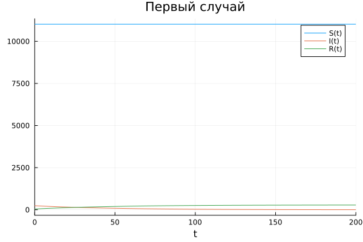
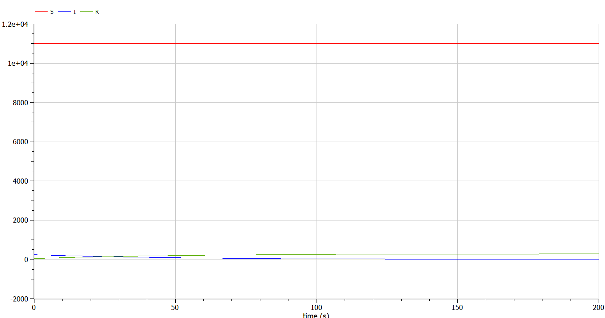
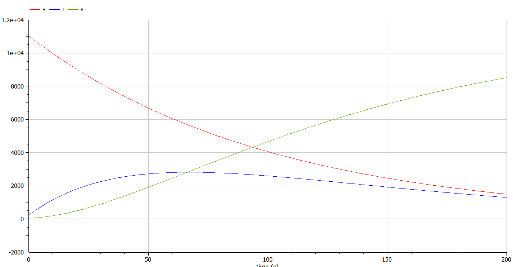

---
# Front matter
lang: ru-RU
title: "Отчет по Лабораторной Работе №6"
subtitle: "Модель эпидемии - Вариант 27"
author: "Озьяс Стев Икнэль Дани"

## Pdf output format
toc: true # Table of contents
toc-depth: 2
fontsize: 12pt
linestretch: 1.5
papersize: a4
documentclass: scrreprt
## I18n polyglossia
polyglossia-lang:
  name: russian
  options:
        - spelling=modern
        - babelshorthands=true
polyglossia-otherlangs:
  name: english
## I18n babel
babel-lang: russian
babel-otherlangs: english
## Fonts
mainfont: PT Serif
romanfont: PT Serif
sansfont: PT Sans
monofont: PT Mono
mainfontoptions: Ligatures=TeX
romanfontoptions: Ligatures=TeX
sansfontoptions: Ligatures=TeX,Scale=MatchLowercase
monofontoptions: Scale=MatchLowercase,Scale=0.9
## Biblatex
biblatex: true
biblio-style: "gost-numeric"
biblatexoptions:
  - parentracker=true
  - backend=biber
  - hyperref=auto
  - language=auto
  - autolang=other*
  - citestyle=gost-numeric
## Pandoc-crossref LaTeX customization
figureTitle: "Рис."
tableTitle: "Таблица"
listingTitle: "Листинг"
lofTitle: "Цель Работы"
lotTitle: "Ход Работы"
lolTitle: "Листинги"
## Misc options
indent: true
header-includes:
  - \usepackage{indentfirst}
  - \usepackage{mathtools}
  - \usepackage{float} # keep figures where there are in the text
  - \floatplacement{figure}{H} # keep figures where there are in the text
---


# Цель работы

Рассмотрим простейшую модель эпидемии. Предположим, что некая популяция, состоящая из N особей, (считаем, что популяция изолирована) подразделяется на три группы. Первая группа - это восприимчивые к болезни, но пока здоровые особи, обозначим их через $S(t)$. Вторая группа – это число инфицированных особей, которые также при этом являются распространителями инфекции, обозначим их $I(t)$. А третья группа, обозначающаяся через $R(t)$ – это здоровые особи с иммунитетом к болезни. 


# Задание

Постройте графики изменения числа особей в каждой из трех групп.

Рассмотрите, как будет протекать эпидемия в случае:

1. если $I(0) \leq I^{*}$

2. если  $I(0) > I^{*}$

# Выполнение лабораторной работы

## Теоретические сведения

До того, как число заболевших не превышает критического значения $I^{\ast}$, считаем, что все больные изолированы и не заражают здоровых. Когда $I(t) > I^{\ast}$, тогда инфицирование способны заражать восприимчивых к болезни особей. Таким образом, скорость изменения числа $S(t)$ меняется по следующему закону:

$$\frac{dS}{dt}= \begin{cases} -aS, & \text{если }  I(t) > I^{\ast} \\\\ 0, & \text{если } I(t) \leq I^{\ast}\end{cases}$$


Поскольку каждая восприимчивая к болезни особь, которая, в конце концов, заболевает, сама становится инфекционной, то скорость изменения числа инфекционных особей представляет разность за единицу времени между заразившимися и теми, кто уже болеет и лечится, т.е.:

$$\frac{dI}{dt} = \begin{cases} aS- bI, & \text{если }  I(t) > I^{\ast}\\\\ -bI, & \text{если } I(t) \leq I^{\ast} \end{cases}$$

А скорость изменения выздоравливающих особей (при этом приобретающие иммунитет к болезни)

$$\frac{dR}{dt} = bI$$

> :memo: **Note:** Постоянные пропорциональности $a$, $b$ , - это коэффициенты заболеваемости и выздоровления соответственно.


## Задача

На одном острове вспыхнула эпидемия. Известно, что из всех проживающих на острове $N=11 300$ в момент начала эпидемии $t=0$ число заболевших людей (являющихся распространителями инфекции) $I(0)=240$, А число здоровых людей с иммунитетом к болезни $R(0)=46$. Таким образом, число людей восприимчивых к болезни, но пока здоровых, в начальный момент времени $S(0)=N-I(0)- R(0)$.


Построили графики изменения числа особей в каждой из трех групп. Рассмотрели, как будет протекать эпидемия в случае:
1. если $I(0) \leq I^{\ast}$

{ #fig:001 width=70% }

{ #fig:003 width=70% }

2. если  $I(0) > I^{\ast}$

{ #fig:002 width=70% }

{ #fig:004 width=70% }


## Код программы (Julia)

```julia
using Plots
using DifferentialEquations

a = 0.01; # коэффициент заболеваемости
b = 0.02; # коэффициент выздоровления
N = 11300; # общая численность популяции
I0 = 240; # количество инфицированных особей в начальный момент времени
R0 = 46; # количество здоровых особей с иммунитетом в начальныймомент времени
S0 = N - I0 - R0; # количество восприимчивых к болезни особей в начальный момент времени

x0 = [S0;I0;R0]; #начальные значения
t = (0,200);

#ПЕРВЫЙ СЛУЧАЙ


# случай, когда I(0)<=I*
function F1(du, u, p, t)
    du[1] = 0;
    du[2] = - b*u[2];
    du[3] = b*u[2];
end

prob = ODEProblem(F1, x0, t)
sol = solve(prob)

display(plot(sol, label=["S(t)" "I(t)" "R(t)"], title="Первый случай"))
savefig("image1.png")


#ВТОРОЙ СЛУЧАЙ
# случай, когда I(0)>I*
function F2(du, u, p, t)
    du[1] = - a*u[1] ;
    du[2] = a*u[1] - b*u[2];
    du[3] = b*u[2];
end

prob = ODEProblem(F2, x0, t)
sol = solve(prob)

display(plot(sol, label=["S(t)" "I(t)" "R(t)"], title="Второй случай"))
savefig("image2.png")
```

## Код программы (OpenModelica)

```julia
// ПЕРВЫЙ СЛУЧАЙ - случай, когда I(0)<=I*

model lab6

parameter Real a = 0.01; // коэффициент заболеваемости
parameter Real b = 0.02; // коэффициент выздоровления
parameter Integer N = 11300; // общая численность популяции
parameter Integer I0 = 240; // количество инфицированных особей в начальный момент времени
parameter Integer R0 = 46; // количество здоровых особей с иммунитетом в начальныймомент времени
parameter Integer S0 = N - I0 - R0; // количество восприимчивых к болезни особей в начальный момент времени

//начальные значения
Real S(start=S0);
Real I(start=I0);
Real R(start=R0);

// случай, когда I(0)>I*
equation
    der(S) = 0 ;
    der(I) = - b*I;
    der(R) = b*I;

end lab6;
```


```julia
// ВТОРОЙ СЛУЧАЙ - случай, когда I(0)>I*

model lab6

parameter Real a = 0.01; // коэффициент заболеваемости
parameter Real b = 0.02; // коэффициент выздоровления
parameter Integer N = 11300; // общая численность популяции
parameter Integer I0 = 240; // количество инфицированных особей в начальный момент времени
parameter Integer R0 = 46; // количество здоровых особей с иммунитетом в начальныймомент времени
parameter Integer S0 = N - I0 - R0; // количество восприимчивых к болезни особей в начальный момент времени

//начальные значения
Real S(start=S0);
Real I(start=I0);
Real R(start=R0);

// случай, когда I(0)>I*
equation
    der(S) = - a*S ;
    der(I) = a*S - b*I;
    der(R) = b*I;

end lab6;
```

# Выводы

В результате проделанной лабораторной работы мы познакомились с моделем эпидемии. 
Проверили, как работает модель в различных ситуациях, показали динамику изменения числа людей в каждой из трех групп в каждом случае.

# Список литературы

1. [Модель эпидемии](https://hal.science/hal-02509142v4/file/epidemie_ru.pdf)
