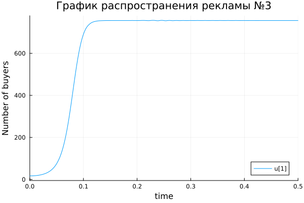

---
## Front matter
title: "Презентация по лабораторной работе №7"
subtitle: "Модель распространения рекламы"
author: "Озьяс Стев Икнэль Дани"

## Generic otions
lang: ru-RU

## Formatting
toc: false
slide_level: 2
theme: metropolis
header-includes:
- \metroset{progressbar=frametitle,sectionpage=progressbar,numbering=fraction}
- '\makeatletter'
- '\beamer@ignorenonframefalse'
- '\makeatother'
aspectratio: 43
section-titles: true
---

# Информация

## Докладчик

:::::::::::::: {.columns align=center}
::: {.column width="70%"}

  * Озьяс Стев Икнэль Дани
  * студент группы НКНбд-01-21
  * Российский университет дружбы народов
  * <https://github.com/Dacossti>

:::
::: {.column width="30%"}

:::
::::::::::::::

# Цели и задачи работы

## Цель лабораторной работы
 
Будем рассматривать модель распространения рекламной кампании.  Построим график решения распространения информации о товаре путем платной рекламы и с учетом «сарафанного радио».

## Задание к лабораторной работе

1. Построить график распространения рекламы о салоне красоты
2. Сравнить эффективность рекламной кампании при $\alpha_1(t) > \alpha_2(t)$ и $\alpha_1(t) < \alpha_2(t)$
3. Определить в какой момент времени эффективность рекламы будет иметь максимально быстрый рост (на вашем примере).

# Процесс выполнения лабораторной работы

## Решение

Построили график распространения рекламы, математическая модель которой описывается следующим уравнением:

## Решение

1. $\frac{dn}{dt} = (0.73 + 0.000013 n(t)) (N- n(t))$ 

{ #fig:001 width=70% }

## Решение

{ #fig:004 width=70% }

## Решение

2. $\frac{dn}{dt} = (0.000013 + 0.73 n(t)) (N- n(t))$

{ #fig:002 width=70% }

## Решение

{ #fig:005 width=70% }

**Момент времени в который скорость распространения рекламы будет иметь максимальное значение = 0.06216763889523805**

## Решение

3. $\frac{dn}{dt} = (0.55sin(t) + 0.33sin(5t) n(t)) (N- n(t))$

{ #fig:003 width=70% }

## Решение

{ #fig:006 width=70% }

# Выводы по проделанной работе

## Вывод

В результате проделанной лабораторной работы мы познакомились с моделем распространения рекламной кампании. Проверили, как работает модель в различных ситуациях, построили графики распрострения рекламы при данных условиях.

# Список литературы

1. [Модель распространения рекламной кампании](https://anylogic.help/ru/tutorials/system-dynamics/12-promotion-strategy.html)