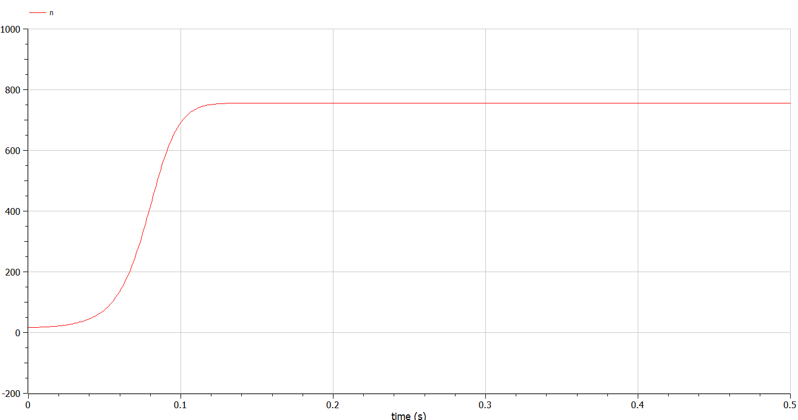

---
# Front matter
lang: ru-RU
title: "Отчет по Лабораторной Работе №7"
subtitle: "Модель распространения рекламы- Вариант 27"
author: "Озьяс Стев Икнэль Дани"

## Pdf output format
toc: true # Table of contents
toc-depth: 2
fontsize: 12pt
linestretch: 1.5
papersize: a4
documentclass: scrreprt
## I18n polyglossia
polyglossia-lang:
  name: russian
  options:
        - spelling=modern
        - babelshorthands=true
polyglossia-otherlangs:
  name: english
## I18n babel
babel-lang: russian
babel-otherlangs: english
## Fonts
mainfont: PT Serif
romanfont: PT Serif
sansfont: PT Sans
monofont: PT Mono
mainfontoptions: Ligatures=TeX
romanfontoptions: Ligatures=TeX
sansfontoptions: Ligatures=TeX,Scale=MatchLowercase
monofontoptions: Scale=MatchLowercase,Scale=0.9
## Biblatex
biblatex: true
biblio-style: "gost-numeric"
biblatexoptions:
  - parentracker=true
  - backend=biber
  - hyperref=auto
  - language=auto
  - autolang=other*
  - citestyle=gost-numeric
## Pandoc-crossref LaTeX customization
figureTitle: "Рис."
tableTitle: "Таблица"
listingTitle: "Листинг"
lofTitle: "Цель Работы"
lotTitle: "Ход Работы"
lolTitle: "Листинги"
## Misc options
indent: true
header-includes:
  - \usepackage{indentfirst}
  - \usepackage{float} # keep figures where there are in the text
  - \floatplacement{figure}{H} # keep figures where there are in the text
---

# Цель работы

Будем рассматривать модель распространения рекламной кампании.  Построим график решения распространения информации о товаре путем платной
рекламы и с учетом «сарафанного радио».

# Задание

1. Построить график распространения рекламы о салоне красоты

2. Сравнить эффективность рекламной кампании при $\alpha_1(t) > \alpha_2(t)$ и $\alpha_1(t) < \alpha_2(t)$

3. Определить в какой момент времени эффективность рекламы будет иметь максимально быстрый рост (на вашем примере).

# Выполнение лабораторной работы

## Теоретические сведения

Организуется рекламная кампания нового товара или услуги. Необходимо, чтобы прибыль будущих продаж с избытком покрывала издержки на рекламу. Вначале расходы могут превышать прибыль, поскольку лишь малая часть потенциальных покупателей будет информирована о новинке. Затем, при увеличении числа продаж, возрастает и прибыль, и, наконец, наступит момент, когда рынок насытиться, и рекламировать товар станет бесполезным.

Модель рекламной кампании описывается следующими величинами. Считаем, что $\frac{dn}{dt}$ - скорость изменения со временем числа потребителей, узнавших о товаре и готовых его купить, t - время, прошедшее с начала рекламной кампании, $n(t)$ - число уже информированных клиентов. Эта величина пропорциональна числу покупателей, еще не знающих о нем, это описывается следующим образом: $\alpha_1(t)(N- n(t))$, где N - общее число потенциальных платежеспособных покупателей, $\alpha_1(t) > 0$ - характеризует интенсивность рекламной кампании (зависит от затрат на рекламу в данный момент времени).


Помимо этого, узнавшие о товаре потребители также распространяют полученную информацию среди потенциальных покупателей, не знающих о нем (в этом случае работает т.н. сарафанное радио). Этот вклад в рекламу описывается величиной $\alpha_2(t) n(t) (N- n(t))$, эта величина увеличивается с увеличением потребителей узнавших о товаре. Математическая модель распространения рекламы описывается уравнением:


$\frac{dn}{dt} = (\alpha_1(t) + \alpha_2(t) n(t)) (N- n(t))$
 

При $\alpha_1(t) > \alpha_2(t)$ получается модель типа модели Мальтуса.


В обратном случае, при получаем уравнение логистической кривой.


## Задача

Постройте график распространения рекламы, математическая модель которой описывается
следующим уравнением:

1. $\frac{dn}{dt} = (0.73 + 0.000013 n(t)) (N- n(t))$ 

{ #fig:001 width=70% }

{ #fig:004 width=70% }

2. $\frac{dn}{dt} = (0.000013 + 0.73 n(t)) (N- n(t))$

{ #fig:002 width=70% }

{ #fig:005 width=70% }

**Момент времени в который скорость распространения рекламы будет иметь максимальное значение = 0.06216763889523805**

3. $\frac{dn}{dt} = (0.55sin(t) + 0.33\sin(5t) n(t)) (N- n(t))$

{ #fig:003 width=70% }

{ #fig:006 width=70% }

## Код программы (Julia)

```julia
using Plots
using DifferentialEquations
using Roots

n0 = 17; #количество людей, знающих о товаре в начальный момент времени
N = 756; #максимальное количество людей, которых может заинтересовать товар
t = (0, 30) #временной промежуток (длительность рекламной компании)

#ПЕРВЫЙ СЛУЧАЙ

a1 = 0.73
a2 = 0.000013

# уравнение, описывающее распространение рекламы
function F(n, p, t)
    dn = (a1 + a2*n)*(N - n)
    return dn;
end

prob = ODEProblem(F, n0, t)
sol = solve(prob)

plot(sol, xlabel="time", ylabel="Number of buyers", title="График распространения рекламы №1")


#ВТОРОЙ СЛУЧАЙ
t = (0, 1) #временной промежуток (длительность рекламной компании)
a1 = 0.000013
a2 = 0.73

# уравнение, описывающее распространение рекламы
function F(n, p, t)
    dn = (a1 + a2*n)*(N - n)
    return dn;
end

prob = ODEProblem(F, n0, t)
sol = solve(prob)

print("Момент времени в который скорость распространения рекламы будет иметь максимальное значение = ", find_zero(t->sol(t) - N, 0))

plot(sol, xlabel="time", ylabel="Number of buyers", title="График распространения рекламы №2")

#ТРЕТИЙ СЛУЧАЙ
t = (0, 1000) #временной промежуток (длительность рекламной компании)
#Функция, отвечающая за платную рекламу
function A1(t)
    return 0.55*sin(t)
end

#функция, описывающая сарафанное радио
function A2(t)
    return 0.33*sin(5*t)
end

# уравнение, описывающее распространение рекламы
function F(n, p, t)
    dn = (A1(t) + A2(t)*n)*(N - n)
    return dn;
end

prob = ODEProblem(F, n0, t)
sol = solve(prob)

plot(sol, xlabel="time", ylabel="Number of buyers", title="График распространения рекламы №3")

```

## Код программы (OpenModelica)

```julia
// ПЕРВЫЙ СЛУЧАЙ
model lab7

parameter Integer N = 756; //максимальное количество людей, которых может заинтересовать товар

parameter Real a1 = 0.73;
parameter Real a2 = 0.000013;

Real n(start= 17); //количество людей, знающих о товаре в начальный момент времени

equation
  der(n) = (a1 + a2*n)*(N - n);
  
end lab7;
```

```julia
// ВТОРОЙ СЛУЧАЙ
model lab7

parameter Integer N = 756; //максимальное количество людей, которых может заинтересовать товар

parameter Real a1 = 0.000013;
parameter Real a2 = 0.73;

Real n(start= 17); //количество людей, знающих о товаре в начальный момент времени

equation
  der(n) = (a1 + a2*n)*(N - n);
  
end lab7;
```

```julia
// ТРЕТИЙ СЛУЧАЙ

model lab7

parameter Integer N = 756; //максимальное количество людей, которых может заинтересовать товар

Real a1;
Real a2;

Real n(start= 17); //количество людей, знающих о товаре в начальный момент времени

equation
  der(n) = (a1 + a2*n)*(N - n);
  a1 = 0.55*sin(time);
  a2 = 0.33*sin(5*time);
  
end lab7;
```

# Выводы

В результате проделанной лабораторной работы мы познакомились с моделем распространения рекламной кампании. Проверили, как работает модель в различных ситуациях, построили графики распрострения рекламы при данных условиях.

# Список литературы

1. [Модель распространения рекламной кампании](https://anylogic.help/ru/tutorials/system-dynamics/12-promotion-strategy.html)
