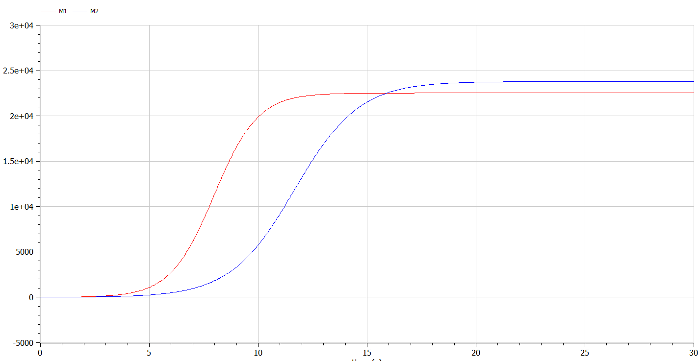
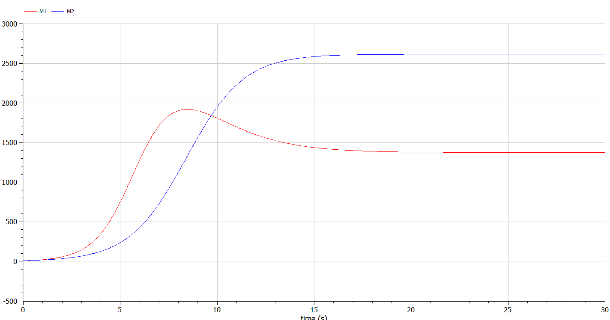

---
## Front matter
title: "Презентация по лабораторной работе №8"
subtitle: "Модель конкуренции двух фирм"
author: "Озьяс Стев Икнэль Дани"

## Generic otions
lang: ru-RU

## Formatting
toc: false
slide_level: 2
theme: metropolis
header-includes:
- \metroset{progressbar=frametitle,sectionpage=progressbar,numbering=fraction}
- '\makeatletter'
- '\beamer@ignorenonframefalse'
- '\makeatother'
aspectratio: 43
section-titles: true
---

# Информация

## Докладчик

:::::::::::::: {.columns align=center}
::: {.column width="70%"}

  * Озьяс Стев Икнэль Дани
  * студент группы НКНбд-01-21
  * Российский университет дружбы народов
  * <https://github.com/Dacossti>

:::
::: {.column width="30%"}

:::
::::::::::::::

# Цели и задачи работы

## Цель лабораторной работы
 
Будем рассматривать модель конкуренции для двух фирм, производящих взаимозаменяемые товары одинакового качества и находящиеся в одной рыночной нише.

## Задание к лабораторной работе

1. Придумайте свой пример двух конкурирующих фирм с идентичным товаром. Задайте начальные значения и известные составляющие. Постройте графики изменения объемов оборотных средств каждой фирмы. Рассмотрите два случая.
2. Проанализируйте полученные результаты.
3. Найдите стационарное состояние системы для первого случая.

# Процесс выполнения лабораторной работы

## Решение

- **Случай 1**

Рассмотрим две фирмы, производящие взаимозаменяемые товары одинакового качества и находящиеся в одной рыночной нише. Считаем, что в рамках нашей модели конкурентная борьба ведётся только рыночными методами. То есть, конкуренты могут влиять на противника путем изменения параметров своего производства: себестоимость, время цикла, но не могут прямо вмешиваться в ситуацию на рынке («назначать» цену или влиять на потребителей каким-либо иным способом.) Будем считать, что постоянные издержки пренебрежимо малы, и в модели учитывать не будем. 

## Решение

В этом случае динамика изменения объемов продаж фирмы 1 и фирмы 2 описывается следующей системой уравнений:

$$
\begin{cases}
	\frac{dM_1}{d\theta} = M_1 - \frac{b}{c_1} M_1 M_2 - \frac{a_1}{c_1} M_1^2\\
	\frac{dM_2}{d\theta} = \frac{c_2}{c_1} M_1 - \frac{b}{c_1} M_1 M_2 - \frac{a_2}{c_1} M_1^2
\end{cases}
$$

{ #fig:001 width=70% }

## Решение

Так же построили график с помощью OpenModelica:

{ #fig:003 width=70% }

## Решение

- **Случай 2**

Рассмотрим модель, когда, помимо экономического фактора влияния (изменение себестоимости, производственного цикла, использование кредита и т.п.), используются еще и социально-психологические факторы – формирование общественного предпочтения одного товара другому, не зависимо от их качества и цены. В этом случае взаимодействие двух фирм будет зависеть друг от друга, соответственно коэффициент перед $M_1 M_2$ будет отличаться. 

## Решение

Пусть в рамках рассматриваемой модели динамика изменения объемов продаж фирмы 1 и фирмы 2 описывается следующей системой уравнений:

$$
\begin{cases}
	\frac{dM_1}{d\theta} = M_1 - \frac{b + 0.00017}{c_1} M_1 M_2 - \frac{a_1}{c1} M_1^2\\
	\frac{dM_2}{d\theta} = \frac{c_2}{c_1} M_1 - \frac{b}{c_1} M_1 M_2 - \frac{a_2}{c1} M_1^2
\end{cases}
$$

{ #fig:002 width=70% }

## Решение

Так же построили график с помощью OpenModelica:

{ #fig:004 width=70% }

# Выводы по проделанной работе

## Вывод

В результате проделанной лабораторной работы мы познакомились с моделем двух фирм. Проверили, как работает модель в различных ситуациях, построили графики изменения оборотных средств при данных условиях.

# Список литературы

1. Малыхин В.И. Математическое моделирование экономики. М., УРАО, 1998.160 с.